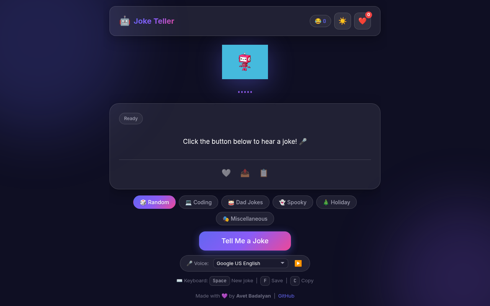
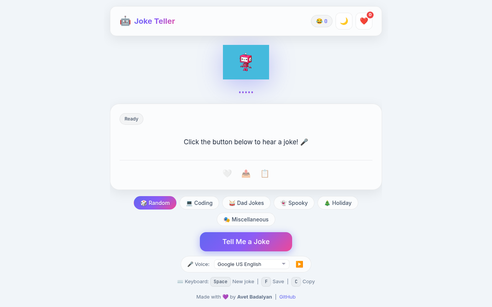
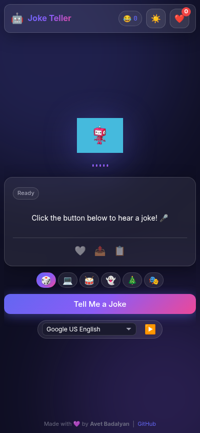

# 🤖 Joke Teller

A polished joke-telling web app with text-to-speech, voice selection,
categories, a saved jokes collection, and a glassmorphism UI — built with pure
HTML, CSS, and JavaScript.

🔗
**[Live Demo → https://get-joke-f9568.web.app](https://get-joke-f9568.web.app)**

| Dark mode                             | Light mode                              | Mobile                                 |
| ------------------------------------- | --------------------------------------- | -------------------------------------- |
|  |  |  |

## ✨ Features

- **Text-to-Speech** — The robot reads every joke aloud using the browser's
  built-in `speechSynthesis` API (no API key needed)
- **Voice Selector** — Choose from all available browser voices; selection
  persists across sessions
- **6 Joke Categories** — Random, Coding, Dad Jokes, Spooky, Holiday,
  Miscellaneous — last selection remembered on reload
- **Saved Jokes** — Save and replay favourites; persisted to `localStorage`
- **Share & Copy** — Web Share API on mobile, clipboard fallback on desktop
- **Dark / Light Mode** — System preference detected, choice saved automatically
- **Typewriter Effect** — Jokes appear character by character; stale animations
  cancel cleanly when a new joke loads
- **Sound Wave Animation** — Pure CSS bars animate while the robot is speaking
- **Keyboard Shortcuts** — `Space` new joke · `F` save · `C` copy · `Esc` close
  panel
- **PWA** — Installable; works offline via Service Worker with a friendly
  offline fallback page
- **Accessible** — ARIA live region announces jokes to screen readers without
  chatty character-by-character updates; `inert` keeps hidden sidebar out of the
  tab order; full focus management on sidebar open/close

## 🛠️ Tech Stack

Pure JavaScript — no frameworks, no build step.

| Technology                         | Purpose                                          |
| ---------------------------------- | ------------------------------------------------ |
| HTML5                              | Semantic markup, ARIA accessibility              |
| CSS3                               | Glassmorphism, CSS custom properties, animations |
| JavaScript ES6+                    | Modular architecture, async/await                |
| Web Speech API (`speechSynthesis`) | Text-to-speech + voice selection                 |
| localStorage                       | Saved jokes, theme, voice & category persistence |
| Service Worker                     | PWA, offline support, network-first caching      |

## 📁 Project Structure

```
public/
├── index.html              # Semantic HTML with full ARIA attributes
├── offline.html            # Offline fallback page
├── style.css               # All styles — design tokens, components, responsive
├── manifest.json           # PWA manifest
├── service-worker.js       # Service worker (network-first, v1.2.1)
└── js/
    ├── config.js           # Centralised settings (API URLs, timing, storage keys)
    ├── storage.js          # localStorage wrapper with error handling
    ├── jokeService.js      # Fetches and normalises jokes from JokeAPI
    ├── audioController.js  # speechSynthesis wrapper + voice selection
    ├── uiController.js     # All DOM updates (view layer)
    └── app.js              # State, event wiring, main controller
```

## 🚀 Running Locally

```bash
# Python (no install needed)
python3 -m http.server 8080 -d public

# Then open http://localhost:8080
```

## ⌨️ Keyboard Shortcuts

| Key     | Action                     |
| ------- | -------------------------- |
| `Space` | New joke                   |
| `F`     | Save / unsave current joke |
| `C`     | Copy joke to clipboard     |
| `Esc`   | Close saved jokes panel    |

## 🎨 Design Notes

**Why pure JavaScript?** This project is intentionally framework-free to
demonstrate mastery of browser fundamentals — the DOM, browser APIs, async
patterns, and modular architecture — without the abstraction of React or Vue
hiding what's actually happening.

**Architecture** follows a simple MVC-like split: `jokeService` fetches data,
`uiController` owns all DOM updates, and `app.js` owns state and wires
everything together. Each file has a single responsibility.

**Accessibility** — semantic landmarks, ARIA labels, dedicated `aria-live`
region for joke announcements (separate from the visible typewriter element),
`inert` on the hidden sidebar to prevent keyboard focus leaking behind the
backdrop, focus management on sidebar open/close, and `prefers-reduced-motion`
support.

## 📱 Browser Support

| Browser         | Support                     |
| --------------- | --------------------------- |
| Chrome / Edge   | ✅ Full                     |
| Firefox         | ✅ Full                     |
| Safari          | ✅ Full                     |
| Mobile browsers | ✅ Responsive + PWA install |

## 👨‍💻 Author

**Avet Badalyan** — Frontend Developer

- GitHub: [@AvetBadalyan](https://github.com/AvetBadalyan)
- Jokes provided by [JokeAPI](https://jokeapi.dev/) (free, no auth required)

---

Made with 💜
